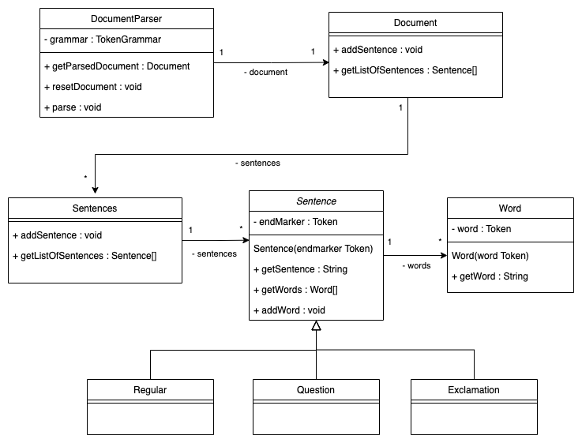

# Parser
**link to example**
**link to class diagram**
**link to manage dependencies**

## About


## Methods
### getParsedDocument()
Returns the Document class object from which you can ask for the current sentences present in the document. As displayed down in the examples.

### resetDocument()
Empties the document from all present sentences.

### parse(String input)
Parses the input adding valid sentences to the document.

## Example
### Instantiate the parser
````
 DocumentParser parser = new DocumentParser(); 
````
### Parse some input
````
 String input = "I am regular. But I have something to say! What was it again?";
 
 parser.parse(input);
 ````
### Use the Document
````
// Get the document...
Document doc = parser.getParsedDocument();

// ...And access all sentences
for (Sentence sentence : document.getAllSentences()) {
    System.out.println(sentence.getSentence());         // Prints out the current sentence
}
````

### Reset Document
````
parser.resetDocument();
````

## Class Diagram


## Manage Depencencies
This is an example for how to manage the dependency of [Tokenizer](https://gitlab.lnu.se/1dv610/student/pr222ja/l1). 

You may have another prefered way of handling dependencies, whichever works best for you.

The main focus here is how to add a .jar-file of the Tokenizer in a way that matches the current build.gradle file. You should have some basic knowledge of how to use gradle as all build steps and such may not be specified.

### Files and folders
- Create a folder called `libs` in the project root.
- Add the `lab1-1.1-SNAPSHOT.jar`-file to the 'libs' folder.
- If you don't already have the .jar-file, follow the next section to create it, and then add it.

### Creating the jar-file
- Download [Tokenizer](https://gitlab.lnu.se/1dv610/student/pr222ja/l1) to your local computer.
- Open the repository and run the gradle task of publishing to MavenLocal. 
- Find the `.m2`-folder on your local computer and look for the file in `.m2/repository/org/example/lab1/1.1-SNAPSHOT/lab1-1.1-SNAPSHOT.jar`. 