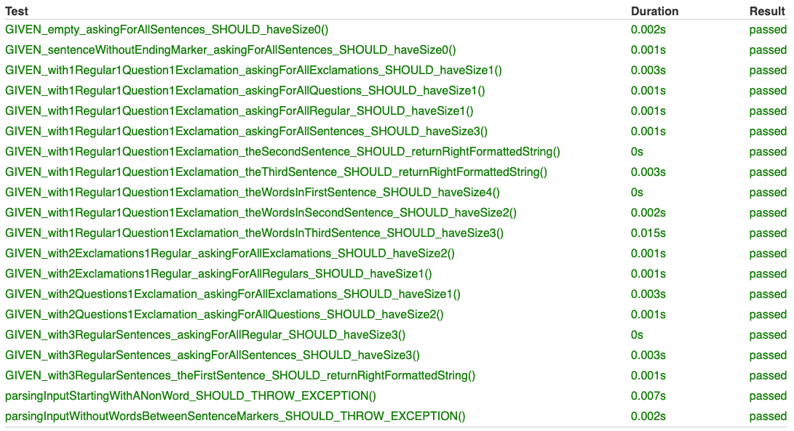

# Mall för inlämning laboration 2, 1dv610

## Checklista
  - [x] Jag har skrivit all kod och reflektioner själv. Jag har inte använt mig av andras kod för att lösa uppgiften.
  - [x] Mina testresultat är skrivna utifrån utförd testning ( och inte teoretiskt, "det bör fungera" :) )
  - [x] De enda statiska metoder eller funktioner utanför klasser som jag har är för att starta upp min testapplikation ex main(java).
  - [x] De enda bibliotek och färdiga klasser som används är sådana som måste användas (eller som används för att testa modulen).

## Egenskattning och mål
  - [ ] Jag är inte klar eftersom jag vet att jag saknar något. Då skall du inte lämna in!
  - [x] Jag eftersträvar med denna inlämning godkänt betyg (E-D)
    - [x] De flesta testfall fungerar (enstaka testfall kan misslyckas, tydligt vilka)
    - [x] Koden är förberedd på återanvändning
    - [x] All kod samt historik finns i git 
    - [ZZZ] Reflektionerna är skrivna
    - [x] Koden är läsbar
  - [ ] Jag eftersträvar med denna inlämning högre betyg (C) och anser mig uppfylla alla extra krav för detta. 
    - [x] Jag är noga i min testning
    - [x] En del av testfallen är automatiserade (Tokenizer/Parser/PP), viss del kan vara manuellt testad.
    - [ZZZ] Det finns en tydlig beskrivning i hur mina moduler skall användas. 
    - [ZZZ] Mina reflektioner visar tydligt att jag förstått bokens koncept.
  - [ ] Jag eftersträvar med denna inlämning högsta betyg (A-B) 
    - [ ] Sammanhängande reflektion som ger ett gott helhetsintryck och visar detaljerad förståelse för kodkvalitet.
    - [ ] Min kod är ... (pussar fingrar och gör smackljud) // ... LOL!
    - [ ] Extrauppgift parser finns med som egen modul(er)

Förtydligande: Examinator kommer sätta betyg oberoende på vad ni anser. Att ha "saker" från högre betygsnivåer verkar positivt och kan väga upp brister i inlämningen.

## Komponenter och återanvändning
- Länka in URL om du använder olika repositorier för dina olika komponenter.
### Tokenizer
Repo:
README:

### Parser
Repo:
README:

### Printer
Repo:
README:
Repot ska vara öppet och tillgängligt för inloggade användare.

 - Beskriv komponenterna och hur de skall användas.
 - Beskriv hur du anpassat din kod och instruktioner för att någon annan programmerare skall kunna använda dina komponenter. Om du skrivit instruktioner för din användare länka till dessa. Om inte beskriv här hur någon skall göra. 
  <!-- Ev extra om hur jar-dependencys behöver läggas till med libs-mapp och jar-fil -->
  <!-- Hämta ner dependencyn, köra gradle task för att publicera i lokala maven-publications, leta rätt på jar-filen i .m2-mappen på datorn, skapa en libs-mapp i projektets repo och lägga dit jar-filen. Sedan lägga till flatdir i gradle.settings samt dependency till implementation med jar-specen. -->
 - Beskriv hur du säkerhetställt att beroendena mellan komponenterna är som beskrivs i laborationen. 

## Beskrivning av min kod
- Beskriv din kod på en hög abstraktionsnivå. En kort beskrivning av dina viktigaste klasser och metoder i dina komponenter. 
- Skapa gärna ett klassdiagram som bild. 
- Beskriv relationerna mellan klasserna mellan komponenter.

## Hur jag testat
- Beskriv hur du kommit fram till om din kod fungerar. Beskriv de olika delarna och hur de testats. Screenshots från manuell testning.
<!-- Parser: Explorativt på resetDocument-metoden. Att subklasserna instantieras rätt (dels bekräftat av automatiska testerna ändå) -->
<!-- Printer: Manuell testning.) -->

### Testfall
Parser: **Screenshot-länk**, **Tabell-länk**
Printer: **Tabell-länk**, **Specificaktion-fil**

#### Testning för parser-modulen
##### Screen shot

##### Tabell
| Namn      | Indata | Förväntat Utfall | PASS/FAIL |
| --------- | ------ | ---------------- | --------- |
| GIVEN_empty_askingForAllSentences_SHOULD_haveSize0() | - | `0` | PASS |
| GIVEN_sentenceWithoutEndingMarker_askingForAllSentences_SHOULD_haveSize0() |`A sentence` |`0` |PASS |
|GIVEN_with3RegularSentences_askingForAllSentences_SHOULD_haveSize3() | `This  is  regular . Another one. Stopping with this.` |`3` | PASS |
| GIVEN_with3RegularSentences_askingForAllRegular_SHOULD_haveSize3() |`This  is  regular . Another one. Stopping with this.` |`3` | PASS |
|GIVEN_with1Regular1Question1Exclamation_askingForAllSentences_SHOULD_haveSize3() |`This is very regular. Another one? Stopping with this!` |`3` |PASS |
|GIVEN_with1Regular1Question1Exclamation_askingForAllRegular_SHOULD_haveSize1() |`This is very regular. Another one? Stopping with this!` |`1` |PASS |
| GIVEN_with1Regular1Question1Exclamation_askingForAllQuestions_SHOULD_haveSize1() | `This is very regular. Another one? Stopping with this!` | `1` |PASS |
| GIVEN_with1Regular1Question1Exclamation_askingForAllExclamations_SHOULD_haveSize1() | `This is very regular. Another one? Stopping with this!` | `1` |PASS |
| GIVEN_with2Questions1Exclamation_askingForAllQuestions_SHOULD_haveSize2() |`Is this regular? Another one? Stopping with this!` | `2` |PASS |
| GIVEN_with2Questions1Exclamation_askingForAllExclamations_SHOULD_haveSize1() | `Is this regular? Another one? Stopping with this!` | `1` |PASS |
| GIVEN_with2Exclamations1Regular_askingForAllExclamations_SHOULD_haveSize2() | `Is not regular! Another one! Stopping with this.` | `2` |PASS |
| GIVEN_with2Exclamations1Regular_askingForAllRegulars_SHOULD_haveSize1() | `Is not regular! Another one! Stopping with this.` |`1` |PASS |
| GIVEN_with3RegularSentences_theFirstSentence_SHOULD_returnRightFormattedString() | `This  is  regular . Another one. Stopping with this.` | `This is regular.` | PASS |
| GIVEN_with1Regular1Question1Exclamation_theSecondSentence_SHOULD_returnRightFormattedString() |`This is very regular. Another one? Stopping with this!` | `Another one?` |PASS |
| GIVEN_with1Regular1Question1Exclamation_theThirdSentence_SHOULD_returnRightFormattedString() | `This is very regular. Another one? Stopping with this!` | `Stopping with this!` | PASS |
|GIVEN_with1Regular1Question1Exclamation_theWordsInFirstSentence_SHOULD_haveSize4() | `This is very regular. Another one? Stopping with this!` | `4` | PASS |
| GIVEN_with1Regular1Question1Exclamation_theWordsInSecondSentence_SHOULD_haveSize2() | `This is very regular. Another one? Stopping with this!` | `2` | PASS |
| GIVEN_with1Regular1Question1Exclamation_theWordsInThirdSentence_SHOULD_haveSize3() | `This is very regular. Another one? Stopping with this!` | `3` | PASS |
| parsingInputStartingWithANonWord_SHOULD_THROW_EXCEPTION() | `. a` |EXCEPTION THROWN | PASS |
| parsingInputWithoutWordsBetweenSentenceMarkers_SHOULD_THROW_EXCEPTION() | `a sentence? a true. ! not` |EXCEPTION THROWN | PASS |
| Success rate: 100% |

#### Testning för printer-modulen

Specifika indata och utdata, samt stegen för testfallen är noggrannare specificerade i manualTests.md **Länk!**

| Test      | Indata | Förväntat Utfall | PASS/FAIL |
| --------- | ------ | ---------------- | --------- |
| TC1 - Different types of sentences prints in different colors | `First! Am I Second? Yeah Maybe.` |  **LÄNK** | PASS |
| TC2 - Add a sentence to a document with previous sentences | `Adding another round.` |  **LÄNK** | PASS |
| TC3 - Clearing the document from sentences | - |  **LÄNK** | PASS |
| TC4 - Quitting the application | - | application stops running | PASS |
| TC5.1 - Invalid sentence, without words | `!!` | error-message & nothing added | PASS |
| TC5.2 - Invalid sentence, after some sentence | `So? !!` | error-message & `So?` added | PASS |
| TC5.3 - Invalid sentence, with valid sentence after | `So? !! But.` | error-message & `So?` added | PASS |
| TC5.4 - Invalid token, before completing sentence | `So ) .` | error-message & nothing added | PASS |
| TC5.5 - Invalid token, valid sentences before and after the token | `So ) But.` | error-message & nothing added | PASS |
| Success rate: 100%  |

## Kapitelreflektioner för kapitel 2-11
- Skriv en kort (4-6 meningar) reflektion för varje kapitel om hur just det kapitlet har påverkat eller inte påverkat din kod.
- Använd bokens termer.
- Ge exempel med läsbara screenshots från er kod till varje reflektion. 
- Fokusera på tydlighet, variation, ärlighet och vad som är intressant: Icke självklara överväganden och konflikter extra intressanta.

### Ch 2. Meaningful names

### Ch 3. Functions

### Ch 4. Comments

### Ch 5. Formatting

### Ch 6. Objects and Data Structures

### Ch 7. Error Handling

### Ch 8. Boundaries

### Ch 9. Unit Tests

### Ch 10. Classes

### Ch 11. Systems

## Laborationsreflektion
Reflektera över uppgiften utifrån din utveckling som programmerare. 
<!-- Att se datastrukturer som ett eget koncept i förhållande till OO-klasser. Procedural och OO programmering, skillnader. -->
Vad har du lärt dig och vad ser du fram emot att lära dig?
<!-- Kanske lära sig GUI för Java, samt ramverket som möjliggör att skriva webbappar helt i Java även med frontend. Fatta buildtools för Java för att slippa ständiga stångandet -->