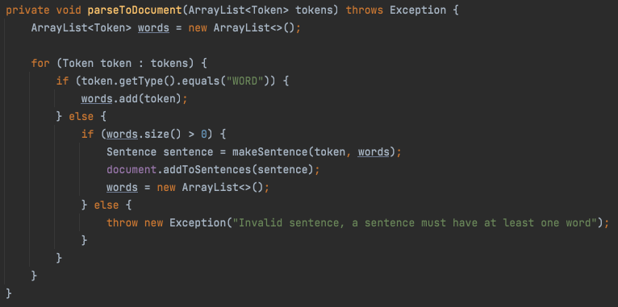
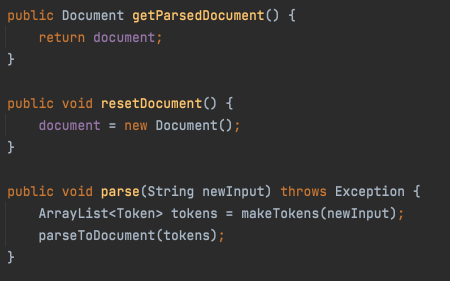
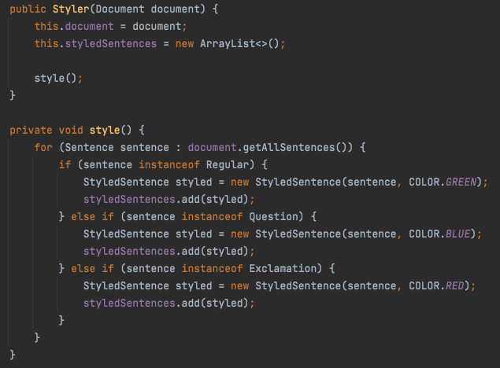
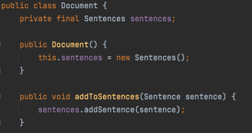
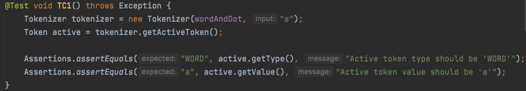
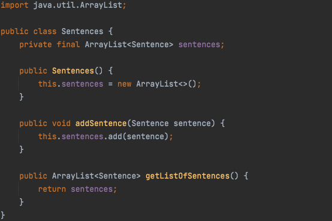
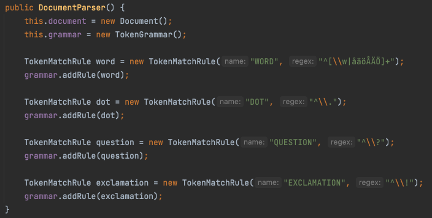

# Mall för inlämning laboration 2, 1dv610

## Checklista
  - [x] Jag har skrivit all kod och reflektioner själv. Jag har inte använt mig av andras kod för att lösa uppgiften.
  - [x] Mina testresultat är skrivna utifrån utförd testning (och inte teoretiskt, "det bör fungera" :))
  - [x] De enda statiska metoder eller funktioner utanför klasser som jag har är för att starta upp min testapplikation ex main(java).
  - [x] De enda bibliotek och färdiga klasser som används är sådana som måste användas (eller som används för att testa modulen).

## Egenskattning och mål
  - [ ] Jag är inte klar eftersom jag vet att jag saknar något. Då skall du inte lämna in!
  - [x] Jag eftersträvar med denna inlämning godkänt betyg (E-D)
    - [x] De flesta testfall fungerar (enstaka testfall kan misslyckas, tydligt vilka)
    - [x] Koden är förberedd på återanvändning
    - [x] All kod samt historik finns i git 
    - [x] Reflektionerna är skrivna
    - [x] Koden är läsbar
  - [ ] Jag eftersträvar med denna inlämning högre betyg (C) och anser mig uppfylla alla extra krav för detta. 
    - [x] Jag är noga i min testning
    - [x] En del av testfallen är automatiserade (Tokenizer/Parser/PP), viss del kan vara manuellt testad.
    - [x] Det finns en tydlig beskrivning i hur mina moduler skall användas. 
    - [x] Mina reflektioner visar tydligt att jag förstått bokens koncept.
  - [ ] Jag eftersträvar med denna inlämning högsta betyg (A-B) 
    - [ ] Sammanhängande reflektion som ger ett gott helhetsintryck och visar detaljerad förståelse för kodkvalitet.
    - [ ] Min kod är ... (pussar fingrar och gör smackljud) // ... LOL!
    - [ ] Extrauppgift parser finns med som egen modul(er)

Förtydligande: Examinator kommer sätta betyg oberoende på vad ni anser. Att ha "saker" från högre betygsnivåer verkar positivt och kan väga upp brister i inlämningen.

## Komponenter och återanvändning
| Komponent |  Repo  | Återanvänding |
| --------- | ------ | ------------- | 
| Tokenizer | [Tokenizer-repo](https://gitlab.lnu.se/1dv610/student/pr222ja/l1) | [README](https://gitlab.lnu.se/1dv610/student/pr222ja/l1/-/blob/master/README.md) |
| Parser | [Parser-repo](https://gitlab.lnu.se/1dv610/student/pr222ja/l2) | [README](https://gitlab.lnu.se/1dv610/student/pr222ja/l2/-/blob/master/README.md) |
| Printer | [Printer-repo](https://gitlab.lnu.se/pr222ja/color-printer)* | [README](https://gitlab.lnu.se/pr222ja/color-printer/-/blob/main/README.md) |
`*` Printer-repot ska vara öppet och tillgängligt för inloggade användare.

Parsern är beroende på Tokenizern och för att få parsern att fungera så behöver Tokenizern läggas till som en jar-fil. Parsern tar in strängar för att tolka strängen och bygger ett dokument-objekt av olika typer utav meningar. Den använder sig utav Tokenizern för att få fram enskilda orden och meningsavslutande tecken. Printern i sin tur är beroende utav båda, eftersom den främst vill använda sig utav parsern men behöver då även Tokenizern för att parsern ska fungera. Så printern behöver se till att få mer jar-filer för både parsern och tokeniseraren.

Beskrivningar för återanvändning utav de enskilda modulerna och importering utav beroendena finns beskrivna i respektive README-fil. 

## Beskrivning av min kod
DocumentParser är parsningsklassen och som håller i Document-klassobjektet som har samlingen utav färdig-parsade meningar. Parsern bygger upp reglerna för hur tokens, delar utav meningarna, ska se ut genom att använda sig utav Tokenizer-paketet. 

ColorPrinter-klassen är den som ber parsern att parsa strängar genom att anropa parserns metod parse(String input) och kan be om parserns document genom getParsedDocument()-metoden för att lägga till documentet till printerns Styler-klass som kan göra slutliga formateringen på meningarna beroende på meningarnas konkreta typ-klasser. 

Diagrammet nedan visar de metoder och klasser som är viktigast för kommunikationen mellan komponenterna. Vardera komponent har ett eget mer detaljerat klassdiagram i deras README-filer. 

### Package diagram

## Hur jag testat
### Testning för parsern
Parsern är i förstahand testad genom automatiska tester. En del explorativ testning har under processen smugit sig in, så som exempelvis för att kolla att resetDocument-metoden tömmer dokumentet på alla meningar eller att alla subklasserna för Sentece har instantierats rätt.

Testerna går i första hand igenom att rätt typer och rätt antal utav typerna utav meningar finns i Document-objektet efter att en parsning har gjorts. Sedan går testerna igenom för att kolla att både meningar och ord blir rätt formaterade för när man ber om dom. Slutligen finns ett par tester för att kolla att undantag kastas när en mening inte börjas med minst ett ord.

### Testning för printern
Printer-modulen har enbart testats manuellt med främst fokus på förväntad lyckad användning. Mot slutet har viss testning även lagts till för vad som väntas ske vid fel på parsningen. Dom testerna är mest för att visa på hur beteendes fungerar i nuläget istället för vad som potentiellt vore det mest användarvänliga sättet.

### Testfall
Parser: [Screen-shot-resultat](https://gitlab.lnu.se/1dv610/student/pr222ja/l2/-/blob/master/release.md#screen-shot), [Tabell-resultat](https://gitlab.lnu.se/1dv610/student/pr222ja/l2/-/blob/master/release.md#tabell)

Printer: [Test-resultats-tabell](https://gitlab.lnu.se/1dv610/student/pr222ja/l2/-/blob/master/release.md#testning-f%C3%B6r-printer-modulen), [Test-specifikations-fil](https://gitlab.lnu.se/pr222ja/color-printer/-/blob/main/manualTests.md)

#### Testning för parser-modulen
##### Screen shot

##### Tabell
| Namn      | Indata | Förväntat Utfall | PASS/FAIL |
| --------- | ------ | ---------------- | --------- |
| GIVEN_empty_askingForAllSentences_SHOULD_haveSize0() | - | `0` | PASS |
| GIVEN_sentenceWithoutEndingMarker_askingForAllSentences_SHOULD_haveSize0() |`A sentence` |`0` |PASS |
|GIVEN_with3RegularSentences_askingForAllSentences_SHOULD_haveSize3() | `This  is  regular . Another one. Stopping with this.` |`3` | PASS |
| GIVEN_with3RegularSentences_askingForAllRegular_SHOULD_haveSize3() |`This  is  regular . Another one. Stopping with this.` |`3` | PASS |
|GIVEN_with1Regular1Question1Exclamation_askingForAllSentences_SHOULD_haveSize3() |`This is very regular. Another one? Stopping with this!` |`3` |PASS |
|GIVEN_with1Regular1Question1Exclamation_askingForAllRegular_SHOULD_haveSize1() |`This is very regular. Another one? Stopping with this!` |`1` |PASS |
| GIVEN_with1Regular1Question1Exclamation_askingForAllQuestions_SHOULD_haveSize1() | `This is very regular. Another one? Stopping with this!` | `1` |PASS |
| GIVEN_with1Regular1Question1Exclamation_askingForAllExclamations_SHOULD_haveSize1() | `This is very regular. Another one? Stopping with this!` | `1` |PASS |
| GIVEN_with2Questions1Exclamation_askingForAllQuestions_SHOULD_haveSize2() |`Is this regular? Another one? Stopping with this!` | `2` |PASS |
| GIVEN_with2Questions1Exclamation_askingForAllExclamations_SHOULD_haveSize1() | `Is this regular? Another one? Stopping with this!` | `1` |PASS |
| GIVEN_with2Exclamations1Regular_askingForAllExclamations_SHOULD_haveSize2() | `Is not regular! Another one! Stopping with this.` | `2` |PASS |
| GIVEN_with2Exclamations1Regular_askingForAllRegulars_SHOULD_haveSize1() | `Is not regular! Another one! Stopping with this.` |`1` |PASS |
| GIVEN_with3RegularSentences_theFirstSentence_SHOULD_returnRightFormattedString() | `This  is  regular . Another one. Stopping with this.` | `This is regular.` | PASS |
| GIVEN_with1Regular1Question1Exclamation_theSecondSentence_SHOULD_returnRightFormattedString() |`This is very regular. Another one? Stopping with this!` | `Another one?` |PASS |
| GIVEN_with1Regular1Question1Exclamation_theThirdSentence_SHOULD_returnRightFormattedString() | `This is very regular. Another one? Stopping with this!` | `Stopping with this!` | PASS |
|GIVEN_with1Regular1Question1Exclamation_theWordsInFirstSentence_SHOULD_haveSize4() | `This is very regular. Another one? Stopping with this!` | `4` | PASS |
| GIVEN_with1Regular1Question1Exclamation_theWordsInSecondSentence_SHOULD_haveSize2() | `This is very regular. Another one? Stopping with this!` | `2` | PASS |
| GIVEN_with1Regular1Question1Exclamation_theWordsInThirdSentence_SHOULD_haveSize3() | `This is very regular. Another one? Stopping with this!` | `3` | PASS |
| parsingInputStartingWithANonWord_SHOULD_THROW_EXCEPTION() | `. a` |EXCEPTION THROWN | PASS |
| parsingInputWithoutWordsBetweenSentenceMarkers_SHOULD_THROW_EXCEPTION() | `a sentence? a true. ! not` |EXCEPTION THROWN | PASS |
| Success rate: 100% |

#### Testning för printer-modulen

Specifika indata och utdata, samt stegen för testfallen är noggrannare specificerade i [manualTests.md](https://gitlab.lnu.se/pr222ja/color-printer/-/blob/main/manualTests.md).

| Test      | Indata | Förväntat Utfall | PASS/FAIL |
| --------- | ------ | ---------------- | --------- |
| TC1 - Different types of sentences prints in different colors | `First! Am I Second? Yeah Maybe.` |  [TC1-expected](https://gitlab.lnu.se/pr222ja/color-printer/-/blob/main/manualTests.md#expected-result) | PASS |
| TC2 - Add a sentence to a document with previous sentences | `Adding another round.` | [TC2-expected](https://gitlab.lnu.se/pr222ja/color-printer/-/blob/main/manualTests.md#expected-result-1) | PASS |
| TC3 - Clearing the document from sentences | - |  [TC3-expected](https://gitlab.lnu.se/pr222ja/color-printer/-/blob/main/manualTests.md#expected-result-2) | PASS |
| TC4 - Quitting the application | - | application stops running | PASS |
| TC5.1 - Invalid sentence, without words | `!!` | error-message & nothing added | PASS |
| TC5.2 - Invalid sentence, after some sentence | `So? !!` | error-message & `So?` added | PASS |
| TC5.3 - Invalid sentence, with valid sentence after | `So? !! But.` | error-message & `So?` added | PASS |
| TC5.4 - Invalid token, before completing sentence | `So ) .` | error-message & nothing added | PASS |
| TC5.5 - Invalid token, valid sentences before and after the token | `So ) But.` | error-message & nothing added | PASS |
| Success rate: 100%  |

## Kapitelreflektioner för kapitel 2-11
### Ch 2. Meaningful names

Inte ett kodexempel, men definitivt ett exempel på pinsamt undermålig namngivning utav tokenizer- och parser-modulerna. Såpass dåliga namn burkar jag inte ha vid namngivning utav filer, borsett då för skoluppgifter där jag vill hålla en regelbundenhet och slippa extra "Mental Mapping". Däremot i perspektivet utav att någon annan skulle använda dessa så är kvaliten under all kritik, särskilt användandet utav litet "L" som gör det otroligt svårläst beroende på typsnitt huruvida det är en etta eller en bokstav. 

Ovanpå det så blev namngivningen inte ens konsekvent med samma namngivningsstandard men det beror mest på min fundamentala okunnighet i hantering utav Java-projekt. Däremot är jag rätt nöjd att jag ändå lyckades få till någon form av versionshantering där, efter alla timmar som jag kämpade och var nära på att ge upp på om det hela.

### Ch 3. Functions

Stor skämskudde för den här metoden. Den är inte liten, den har för många nästlade if- och else-satser, den gör mer än en sak, den har blandade nivåer utav asbstaktion, den har argument som kanske hade kunnat undvikas genom att ha det som klassvariabel istället, och argument-namnet är dessutom egentligen inte särskilt besrkivande för vad den har för syfte till metoden. Så metoden följer inte riktigt någon utav reglerna för hur bra funktioner ska skrivas. 

Vad den däremot indirekt visar på är hur viktigt det är med refaktorering och "uppsnyggning" utav koden som en del utav skrivarprocessen. Den här versionen är endast resultatet utav en första omskrivning från det första "få det bara att fungera"-utkastet. Det är först nu efter att koden har fått "smälta" ett tag som jag ser små hintar här och där för hur jag skulle kunna börja med för att snygga till det till en bättre lösning, jämfört när den var precis nyomskriven och i press för deadlinen.

### Ch 4. Comments

Det har varit en fröjd att för en gångs skull slippa "Mandated Comments" som förekommit i majoriteten utav kurserna hittills. Det har också underlättat förståelsen i processen utav att lära sig att använda högre abstraktionsnivå med hjälp av längre metodnamn. Det har också varit skönt att få tillåtelse utav boken på många punkter att slippa många och dåliga typer utav kommentarer. 

Det har dock lett till att jag i stort sett uteslutigt i princip all form av kommentering utav koden. De tre metoderna ovan är dock exempel på metoder där jag skulle kunna tänka mig att vilja lägga till javadoc-kommentarer eftersom de är huvudmetoderna som är tänkta att användas på DocumentParser-klassen utav andra moduler. På så sätt skulle det ytterligare stärka dokumentationen och underlätta användandet utav parsern för användaren utav modulen.

### Ch 5. Formatting

I vanliga fall skulle jag utgå ifrån att försöka ha de publika metoderna direkt nedanför konstuktorn. Men i det här fallet tyckte jag det var viktigare att följa principen utav "Conceptual Affinity" och låta den privata metoden som anropas i kontruktorn komma direkt nedanför. Trots att klassen är rätt liten så ökar det snabbheten i att komma in i vad som händer väsentligt snabbare än om style()-metoden hade blivit nedknuffad i förmån för en simpel getter-metod. 

Sen är det väl kanske en annan sak att bredden på raderna i metoden börjar närma sig bekvämlighetsgränsen för vad jag skulle anse är en bra maxbredd för en kodrad. Att köra "instanceof" på meningarna är kanske inte heller den snyggaste och bästa lösningen men för tillfället är jag mest nöjd med att jag överhuvudtaget lyckats hitta syntaxen och få den checken att fungera, vilket är något jag haft problem med tidigare i Java.

### Ch 6. Objects and Data Structures

Innan påbörjandet utav parsern och efter att ha läst kapitlet kändes det rätt självklart och naturligt hur jag skulle lägga upp klasserna inom Document för att bygga upp en datastruktur. Vid återbesök av kapitlet såhär efteråt blev jag dock aningens förvirrad, för räknas add-metoden så som ovan till att klassen istället blev en hybrid-form mellan "Objekt" och datastruktur så som boken påstår att man ska undvika? Eller metoderna längre ner i kedjan som har metoder för att returnera sträng-representationen utav meningen eller ordet? 

Även om de skulle räknas som hybrider så skulle jag ändå luta åt att klassificera dom som mer åt data-struktur-hållet. De har åtminstone inte någon meningsfull logik eller beteende till sig så som exempelvis DocumentParser har. Problemet i så fall skulle mer ligga åt hur alla metoderna är publika, vilket kanske hade varit ett fall att på vissa ställen testa på att använda sig utav protected-accessorn som jag tidigare inte märkt något behov av att använda i tidigare uppgifter.

### Ch 7. Error Handling

I början utav kursen hade jag inte någon koll på konceptet utav "Checked Exceptions", vars nackdelar jag fått uppleva genom att IDE:n inte har tillåtit mig att köra utan dem. Så alla enhetstest i tokenizern behövde ha "throws Exception" tillagt i signaturen eftersom konstruktorn för ett nytt Tokenizer-objekt anropar en metod som anropar vidare på ytterligare en metod som kastar undantag. Lyckligtvis slapp jag ha samma scenario för parsern och lägga till samma sak i signaturen för enhetstesterna där men även parsern har tre olika metoder som kastar egna undantag. 

Så jag fick ändå direkt erfarenhet med nackdelen av att när man lägger till lågnivå-metoder som kastar undantag så måste även alla andra kopplade högre metoders signatur ändras, vilket boken framförallt påpekar bryter mot "Open/Closed Principle" då alla metoder i kedjan helt plötsligt måste känna till låga metodens förmåga att kasta undantag. Trösten boken ändå ger i det här fallet att det för kritiska bibliotek kan vara bra att ha kastande utav undantag på det sättet, eftersom det tvingar den som använder biblioteket att se till att hantera undantagen när de kastas.

### Ch 8. Boundaries

Här är påbörjan på att försöka "gömma" tredjepartskod i en egen collection-klass. Boken förespråkar det dels för att det minskar platser där kod behöver ändras ifall vi skulle få för oss att använda något annat än ArrayList som i det här fallet, och dels för att man öppnar upp koden för onödigt många möjligheter med tredjepartskodens inkuderade metoder. 

Men i slutändan trots mitt försök i samtliga moduler så returnerar jag ju ändå en ArrayList i alla fall. Dessutom är get-metoden endast menad att användas utav Document-klassen vilket skapar onödig öppenhet och potentiell förvirring utav någon som ska använda parser-modulen. Ett interface för parsern eller Document hade kanske varit i sin ordning, samt bredare kunskap hur man kan skapa itererbara egna klasser i Java.

### Ch 9. Unit Tests

Alla enhetstester i parser-modulen har en assertion per test så som boken förespråkar med "One Assert per Test". I tokenizer-modulen fanns flertal tester med 2 assertions i samma test men inför parser-modulen så hann jag ta i hänsyn rekommendationen från boken att försöka minimera antalet assertions i varje test. 

Däremot lyckades jag inte hålla mig till "The Three Laws of TDD" med att skriva testerna innan jag skrev produktionskoden. Vad jag å andra sidan verkligen har märkt under både parsern och tokenizern är att automatiska testerna "enable all the -ilities" och ger trygghet till att göra refektoreringar i koden, utan att behöva oroa sig för att man förstör koden. 

### Ch 10. Classes

Utifrån feedbacken ifrån första tokenizer-uppgiften så gjorde jag ett par ändringar. Jag tog bort settern för regexet som jag hade lagt till "ifall en senare programmerare vill ta reda på vad för regex som använts" eftersom det i början var rätt otydligt hur modulen faktiskt är tänkt att användas utav någon annan och vad som är relevant att komma åt. Men det här blev ändå en påminnelse om att försöka i första hand försöka utgå ifrån stark "Encapsulation" och sedan öppna upp om det verkligen skulle visa sig nödvändigt ifrån ändrade omständigheter. 

Jag flyttade då sedan även matchings-förfarandet till den här klassen för stärkandet utav "Cohesion". Innan tokenizer-uppgiften hade jag inte ens hört talas om att cohesion framförallt kommer ifrån att metoderna i klassen i största mån ska använda sig utav sina klassvariabler. Det hjälpte mig senare vid skapandet utav printern, där jag märkte snabbt att "Maintaining Cohesion Results in Many Small Classes", då printern slutade upp i mycket fler klasser än vad jag hade trott innan jag började jobba på den.

### Ch 11. Systems

Enligt boken så bör objekt som är beroende utav ett annat objekt inte vara den som också instansierar det, för att försöka hålla sig till "Single Responsibility Principle" i system och för att lyckas med det så rekommenderas "Dependency Injection". Det hade egenltigen varit mitt föredragna sätt att göra det i det här fallet, där grammatiken skapats utanför parsern för att sedan skickas in som argument till parserns konstruktor. 

Om jag hade redan vid skapandet av parsern insett att printer-modulen skulle resultera i så många klasser som den gjorde så hade jag nog garanterat bemödat mig det lilla extra med att faktiskt separera det, för att låta printern skapa just den grammatiken den behöver och inte som nu vara helt begränsad till vad parsern råkar tillåta. Nu resulterade det istället i en medvetet ful short-cut för att få klart uppgiften.

## Laborationsreflektion
Det har varit en lyxa att få tiden till att bearbeta sin kod, särskilt med feedback emellanåt och därigenom hitta nya kopplingar som man kanske inte hade hittat naturligt i första taget. Även om jag inte hann bearbeta DocumentParser mer än en gång så ser jag det som ett gott tecken att vid det här laget ha en start känsla om hur jag skulle kunna fortsätta jobba på denna "work in progress"-kod. 

Jag hann inte riktigt komma in på hur jag eventuellt hade kunnat använda mig utav Factory Pattern för att kunna skapa de olika typerna utav meningarna. Oerfarenheten över lag utav att utnyttja de olika sub-typerna på ett "smart" sätt ledde naturligt till antagligen mer duplicering utav kod än nödvändigt. Men för den här gången nöjer jag mig med att jag lyckades få till abstrakta Sentence klassen och ha det i metodsargument, något jag försökt lite vid något tidigare tillfälle men misslyckats.

Det var också trevligt att få känna kraften utav att ha automatiska testerna i ryggen. Framförallt också av att ha skrivit testerna själv, jämfört med tidigare kurser där det funnits färdiga tester som man bara ska beta av som en todo-list en gång utan refaktoreringar.

Jag ser framemot att bli bättre på att använda mig utav faktiska interface:s, vilket började släppa lite i föregående kursen så som abstrakta klasser har släppt för mig i denna. Det hade också varit trevlig att få en mer grundläggande kunskap kring buildtools för Java överlag. För även om jag lärt mig en hel del genom stångande med samarbete mellan olika delar så skulle nog lite mer kunskap om de grundläggande koncepten hjälpa en hel del. Om inte annat så var det i alla fall väldigt trevligt att passa på att testa att koda i Intellij för uppgifterna i kursen och det har verkligen gett en helt annan positiv insyn till Java över lag! :)

