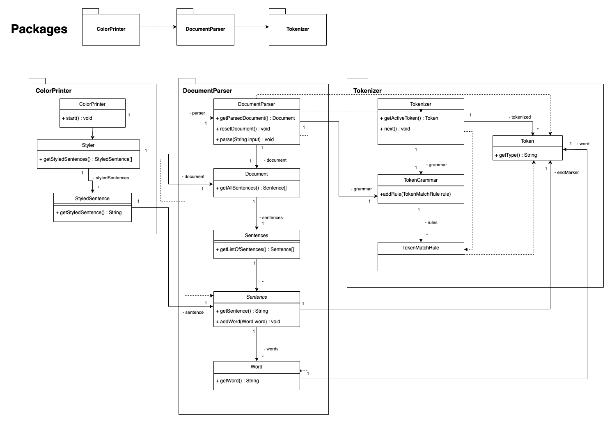
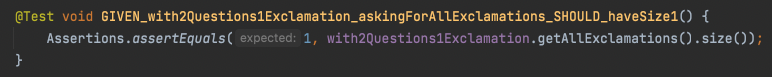
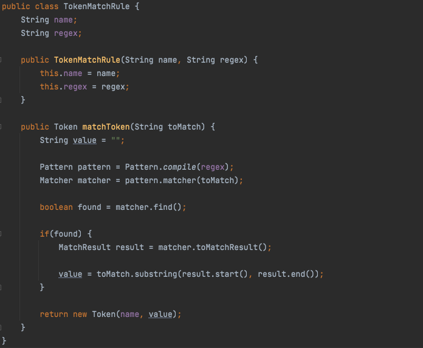

# Mall för inlämning laboration 2, 1dv610

## Checklista
  - [x] Jag har skrivit all kod och reflektioner själv. Jag har inte använt mig av andras kod för att lösa uppgiften.
  - [x] Mina testresultat är skrivna utifrån utförd testning (och inte teoretiskt, "det bör fungera" :))
  - [x] De enda statiska metoder eller funktioner utanför klasser som jag har är för att starta upp min testapplikation ex main(java).
  - [x] De enda bibliotek och färdiga klasser som används är sådana som måste användas (eller som används för att testa modulen).

## Egenskattning och mål
  - [ ] Jag är inte klar eftersom jag vet att jag saknar något. Då skall du inte lämna in!
  - [x] Jag eftersträvar med denna inlämning godkänt betyg (E-D)
    - [x] De flesta testfall fungerar (enstaka testfall kan misslyckas, tydligt vilka)
    - [x] Koden är förberedd på återanvändning
    - [x] All kod samt historik finns i git 
    - [ZZZ] Reflektionerna är skrivna
    - [x] Koden är läsbar
  - [ ] Jag eftersträvar med denna inlämning högre betyg (C) och anser mig uppfylla alla extra krav för detta. 
    - [x] Jag är noga i min testning
    - [x] En del av testfallen är automatiserade (Tokenizer/Parser/PP), viss del kan vara manuellt testad.
    - [x] Det finns en tydlig beskrivning i hur mina moduler skall användas. 
    - [ZZZ] Mina reflektioner visar tydligt att jag förstått bokens koncept.
  - [ ] Jag eftersträvar med denna inlämning högsta betyg (A-B) 
    - [ ] Sammanhängande reflektion som ger ett gott helhetsintryck och visar detaljerad förståelse för kodkvalitet.
    - [ ] Min kod är ... (pussar fingrar och gör smackljud) // ... LOL!
    - [ ] Extrauppgift parser finns med som egen modul(er)

Förtydligande: Examinator kommer sätta betyg oberoende på vad ni anser. Att ha "saker" från högre betygsnivåer verkar positivt och kan väga upp brister i inlämningen.

## Komponenter och återanvändning
| Komponent |  Repo  | Återanvänding |
| --------- | ------ | ------------- | 
| Tokenizer | [Tokenizer-repo](https://gitlab.lnu.se/1dv610/student/pr222ja/l1) | [README](https://gitlab.lnu.se/1dv610/student/pr222ja/l1/-/blob/master/README.md) |
| Parser | [Parser-repo](https://gitlab.lnu.se/1dv610/student/pr222ja/l2) | [README](https://gitlab.lnu.se/1dv610/student/pr222ja/l2/-/blob/master/README.md) |
| Printer | [Printer-repo](https://gitlab.lnu.se/pr222ja/color-printer)* | [README](https://gitlab.lnu.se/pr222ja/color-printer/-/blob/main/README.md) |
`*` Printer-repot ska vara öppet och tillgängligt för inloggade användare.

Parsern är beroende på Tokenizern och för att få parsern att fungera så behöver Tokenizern läggas till som en jar-fil. Parsern tar in strängar för att tolka strängen och bygger ett dokument-objekt av olika typer utav meningar. Den använder sig utav Tokenizern för att få fram enskilda orden och meningsavslutande tecken. Printern i sin tur är beroende utav båda, eftersom den främst vill använda sig utav parsern men behöver då även Tokenizern för att parsern ska fungera. Så printern behöver se till att få mer jar-filer för både parsern och tokeniseraren.

Beskrivningar för återanvändning utav de enskilda modulerna och importering utav beroendena finns beskrivna i respektive README-fil. 

## Beskrivning av min kod
DocumentParser är parsningsklassen och som håller i Document-klassobjektet som har samlingen utav färdig-parsade meningar. Parsern bygger upp reglerna för hur tokens, delar utav meningarna, ska se ut genom att använda sig utav Tokenizer-paketet. 

ColorPrinter-klassen är den som ber parsern att parsa strängar genom att anropa parserns metod parse(String input) och kan be om parserns document genom getParsedDocument()-metoden för att lägga till documentet till printerns Styler-klass som kan göra slutliga formateringen på meningarna beroende på meningarnas konkreta typ-klasser. 

Diagrammet nedan visar de metoder och klasser som är viktigast för kommunikationen mellan komponenterna. Vardera komponent har ett eget mer detaljerat klassdiagram i deras README-filer. 

### Package diagram

## Hur jag testat
### Testning för parsern
Parsern är i förstahand testad genom automatiska tester. En del explorativ testning har under processen smugit sig in, så som exempelvis för att kolla att resetDocument-metoden tömmer dokumentet på alla meningar eller att alla subklasserna för Sentece har instantierats rätt.

Testerna går i första hand igenom att rätt typer och rätt antal utav typerna utav meningar finns i Document-objektet efter att en parsning har gjorts. Sedan går testerna igenom för att kolla att både meningar och ord blir rätt formaterade för när man ber om dom. Slutligen finns ett par tester för att kolla att undantag kastas när en mening inte börjas med minst ett ord.

### Testning för printern
Printer-modulen har enbart testats manuellt med främst fokus på förväntad lyckad användning. Mot slutet har viss testning även lagts till för vad som väntas ske vid fel på parsningen. Dom testerna är mest för att visa på hur beteendes fungerar i nuläget istället för vad som potentiellt vore det mest användarvänliga sättet.

### Testfall
Parser: [Screen-shot-resultat](https://gitlab.lnu.se/1dv610/student/pr222ja/l2/-/blob/master/release.md#screen-shot), [Tabell-resultat](https://gitlab.lnu.se/1dv610/student/pr222ja/l2/-/blob/master/release.md#tabell)

Printer: [Test-resultats-tabell](https://gitlab.lnu.se/1dv610/student/pr222ja/l2/-/blob/master/release.md#testning-f%C3%B6r-printer-modulen), [Test-specifikations-fil](https://gitlab.lnu.se/pr222ja/color-printer/-/blob/main/manualTests.md)

#### Testning för parser-modulen
##### Screen shot

##### Tabell
| Namn      | Indata | Förväntat Utfall | PASS/FAIL |
| --------- | ------ | ---------------- | --------- |
| GIVEN_empty_askingForAllSentences_SHOULD_haveSize0() | - | `0` | PASS |
| GIVEN_sentenceWithoutEndingMarker_askingForAllSentences_SHOULD_haveSize0() |`A sentence` |`0` |PASS |
|GIVEN_with3RegularSentences_askingForAllSentences_SHOULD_haveSize3() | `This  is  regular . Another one. Stopping with this.` |`3` | PASS |
| GIVEN_with3RegularSentences_askingForAllRegular_SHOULD_haveSize3() |`This  is  regular . Another one. Stopping with this.` |`3` | PASS |
|GIVEN_with1Regular1Question1Exclamation_askingForAllSentences_SHOULD_haveSize3() |`This is very regular. Another one? Stopping with this!` |`3` |PASS |
|GIVEN_with1Regular1Question1Exclamation_askingForAllRegular_SHOULD_haveSize1() |`This is very regular. Another one? Stopping with this!` |`1` |PASS |
| GIVEN_with1Regular1Question1Exclamation_askingForAllQuestions_SHOULD_haveSize1() | `This is very regular. Another one? Stopping with this!` | `1` |PASS |
| GIVEN_with1Regular1Question1Exclamation_askingForAllExclamations_SHOULD_haveSize1() | `This is very regular. Another one? Stopping with this!` | `1` |PASS |
| GIVEN_with2Questions1Exclamation_askingForAllQuestions_SHOULD_haveSize2() |`Is this regular? Another one? Stopping with this!` | `2` |PASS |
| GIVEN_with2Questions1Exclamation_askingForAllExclamations_SHOULD_haveSize1() | `Is this regular? Another one? Stopping with this!` | `1` |PASS |
| GIVEN_with2Exclamations1Regular_askingForAllExclamations_SHOULD_haveSize2() | `Is not regular! Another one! Stopping with this.` | `2` |PASS |
| GIVEN_with2Exclamations1Regular_askingForAllRegulars_SHOULD_haveSize1() | `Is not regular! Another one! Stopping with this.` |`1` |PASS |
| GIVEN_with3RegularSentences_theFirstSentence_SHOULD_returnRightFormattedString() | `This  is  regular . Another one. Stopping with this.` | `This is regular.` | PASS |
| GIVEN_with1Regular1Question1Exclamation_theSecondSentence_SHOULD_returnRightFormattedString() |`This is very regular. Another one? Stopping with this!` | `Another one?` |PASS |
| GIVEN_with1Regular1Question1Exclamation_theThirdSentence_SHOULD_returnRightFormattedString() | `This is very regular. Another one? Stopping with this!` | `Stopping with this!` | PASS |
|GIVEN_with1Regular1Question1Exclamation_theWordsInFirstSentence_SHOULD_haveSize4() | `This is very regular. Another one? Stopping with this!` | `4` | PASS |
| GIVEN_with1Regular1Question1Exclamation_theWordsInSecondSentence_SHOULD_haveSize2() | `This is very regular. Another one? Stopping with this!` | `2` | PASS |
| GIVEN_with1Regular1Question1Exclamation_theWordsInThirdSentence_SHOULD_haveSize3() | `This is very regular. Another one? Stopping with this!` | `3` | PASS |
| parsingInputStartingWithANonWord_SHOULD_THROW_EXCEPTION() | `. a` |EXCEPTION THROWN | PASS |
| parsingInputWithoutWordsBetweenSentenceMarkers_SHOULD_THROW_EXCEPTION() | `a sentence? a true. ! not` |EXCEPTION THROWN | PASS |
| Success rate: 100% |

#### Testning för printer-modulen

Specifika indata och utdata, samt stegen för testfallen är noggrannare specificerade i [manualTests.md](https://gitlab.lnu.se/pr222ja/color-printer/-/blob/main/manualTests.md).

| Test      | Indata | Förväntat Utfall | PASS/FAIL |
| --------- | ------ | ---------------- | --------- |
| TC1 - Different types of sentences prints in different colors | `First! Am I Second? Yeah Maybe.` |  [TC1-expected](https://gitlab.lnu.se/pr222ja/color-printer/-/blob/main/manualTests.md#expected-result) | PASS |
| TC2 - Add a sentence to a document with previous sentences | `Adding another round.` | [TC2-expected](https://gitlab.lnu.se/pr222ja/color-printer/-/blob/main/manualTests.md#expected-result-1) | PASS |
| TC3 - Clearing the document from sentences | - |  [TC3-expected](https://gitlab.lnu.se/pr222ja/color-printer/-/blob/main/manualTests.md#expected-result-2) | PASS |
| TC4 - Quitting the application | - | application stops running | PASS |
| TC5.1 - Invalid sentence, without words | `!!` | error-message & nothing added | PASS |
| TC5.2 - Invalid sentence, after some sentence | `So? !!` | error-message & `So?` added | PASS |
| TC5.3 - Invalid sentence, with valid sentence after | `So? !! But.` | error-message & `So?` added | PASS |
| TC5.4 - Invalid token, before completing sentence | `So ) .` | error-message & nothing added | PASS |
| TC5.5 - Invalid token, valid sentences before and after the token | `So ) But.` | error-message & nothing added | PASS |
| Success rate: 100%  |

## Kapitelreflektioner för kapitel 2-11
- Skriv en kort (4-6 meningar) reflektion för varje kapitel om hur just det kapitlet har påverkat eller inte påverkat din kod.
- Använd bokens termer.
- Ge exempel med läsbara screenshots från er kod till varje reflektion. 
- Fokusera på tydlighet, variation, ärlighet och vad som är intressant: Icke självklara överväganden och konflikter extra intressanta.

### Ch 2. Meaningful names

### Ch 3. Functions

### Ch 4. Comments

### Ch 5. Formatting

### Ch 6. Objects and Data Structures

### Ch 7. Error Handling

### Ch 8. Boundaries

### Ch 9. Unit Tests

Alla enhetstester i parser-modulen har en assertion per test så som boken förespråkar med "One Assert per Test". I tokenizer-modulen fanns flertal tester med 2 assertions i samma test men inför parser-modulen så hann jag ta i hänsyn rekommendationen från boken att försöka minimera antalet assertions i varje test. Däremot lyckades jag inte hålla mig till "The Three Laws of TDD" med att skriva testerna innan jag skrev produktionskoden. Vad jag å andra sidan verkligen har märkt under både parsern och tokenizern är att automatiska testerna "enable all the -ilities" och ger trygghet till att göra refektoreringar i koden, utan att behöva oroa sig för att man förstör koden. 

### Ch 10. Classes

Utifrån feedbacken ifrån första tokenizer-uppgiften så gjorde jag ett par ändringar. Jag tog bort settern för regexet som jag hade lagt till "ifall en senare programmerare vill ta reda på vad för regex som använts" eftersom det i början var rätt otydligt hur modulen faktiskt är tänkt att användas utav någon annan och vad som är relevant att komma åt. Men det här blev ändå en påminnelse om att försöka i första hand försöka utgå ifrån stark "Encapsulation" och sedan öppna upp om det verkligen skulle visa sig nödvändigt ifrån ändrade omständigheter. Jag flyttade då sedan även matchings-förfarandet till den här klassen för stärkandet utav "Cohesion". Innan tokenizer-uppgiften hade jag inte ens hört talas om att cohesion framförallt kommer ifrån att metoderna i klassen i största mån ska använda sig utav sina klassvariabler. Det hjälpte mig senare vid skapandet utav printern, där jag märkte snabbt att "Maintaining Cohesion Results in Many Small Classes", då printern slutade upp i mycket fler klasser än vad jag hade trott innan jag började jobba på den.

### Ch 11. Systems

## Laborationsreflektion
Reflektera över uppgiften utifrån din utveckling som programmerare. 
<!-- Att se datastrukturer som ett eget koncept i förhållande till OO-klasser. Procedural och OO programmering, skillnader. -->

Vad har du lärt dig och vad ser du fram emot att lära dig?
<!-- Kanske lära sig GUI för Java, samt ramverket som möjliggör att skriva webbappar helt i Java även med frontend. Fatta buildtools för Java för att slippa ständiga stångandet -->